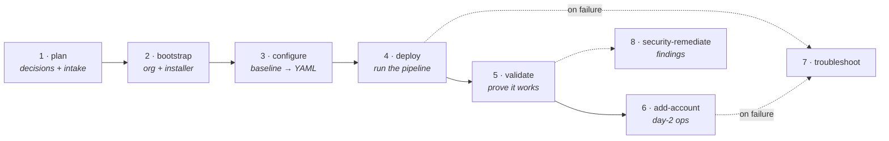

# lza-skills

**Field playbooks for deploying AWS Landing Zone Accelerator — as Claude Code skills.**

Eight sequenced skills take a practitioner from the first customer conversation to a validated,
hardened landing zone, plus the intake tooling that turns customer requirements into
config-ready YAML, a review workbook, and a Word requirements document.


> **Reference engine:** [awslabs/landing-zone-accelerator-on-aws](https://github.com/awslabs/landing-zone-accelerator-on-aws) v1.15.0
> · **Baseline config:** [aws/lza-universal-configuration](https://github.com/aws/lza-universal-configuration)

---

## Contents

[Why this exists](#why-this-exists) · [Quick start](#quick-start) · [The skills](#the-skills) ·
[Engagement flow](#engagement-flow) · [Intake tooling](#intake-tooling) ·
[Repository layout](#repository-layout) · [Prerequisites](#prerequisites) ·
[Handling customer data](#handling-customer-data) · [On the AWS LZA MCP Server](#on-the-aws-lza-mcp-server) ·
[Versioning & contributing](#versioning--contributing)

---

## Why this exists

LZA's own documentation explains *what each config key does*. It does not tell you which
decisions are irreversible, what a stuck pipeline looks like versus a failing one, or why a
Security Hub suppression rule you wrote silently never fires.

These skills encode that operational layer:

- **Opinionated by default** — each skill proposes a concrete design (prefix, OU tree, account
  list, full VPC/subnet/CIDR layout) for the customer to approve, rather than handing them a
  blank page.
- **Irreversibility is called out** — every decision is labelled reversible, painful, or
  permanent, so the expensive ones get made deliberately on day one.
- **Failure modes are documented from the field** — real symptoms mapped to real root causes,
  with fix scripts attached.

---

## Quick start

```bash
git clone https://github.com/Sajidalinbs/lza-skills.git && cd lza-skills

# Install all eight skills for Claude Code (symlinks — edits here take effect immediately).
# Folders are numbered for flow order; the symlink drops the number so invocation
# stays /lza-plan, /lza-bootstrap, …
mkdir -p ~/.claude/skills
for d in [1-9]-lza-*; do ln -snf "$PWD/$d" "$HOME/.claude/skills/${d#*-}"; done
ls -la ~/.claude/skills | grep lza-        # verify

# Optional: intake tooling dependencies
pip install openpyxl pyyaml
```

Start a **new** Claude Code session (skills are loaded at startup), then:

```
/lza-plan
```

Producing the customer's requirements document takes one command:

```bash
python3 intake/make_docx.py intake/lza-intake-form.md --customer "Acme Corp"
# → Acme_Corp_AWS_LZA_Intake.docx
```

---

## The skills

Each folder holds the authoritative **`SKILL.md`** (the playbook Claude Code loads) and a short
`README.md` for browsing on GitHub.

| # | Skill | Invoke when | Covers |
|:--:|---|---|---|
| 1 | [`lza-plan`](1-lza-plan/) | Start of a new engagement | 8 irreversible decisions: prefix, regions, OU/account design, **proposed default network (VPCs + subnets + CIDRs)**, SSO, compliance, tagging |
| 2 | [`lza-bootstrap`](2-lza-bootstrap/) | First-time AWS Org setup | Management-account checks, Organizations trusted-services audit, break-glass, quotas, Control Tower decision, IAM Identity Center, **GitHub CodeConnections + token prerequisites**, installer CloudFormation |
| 3 | [`lza-configure`](3-lza-configure/) | Filling in the config | **Start from the AWS baseline**, then customize every YAML (replacements, accounts, organization, global, security, network, iam, customizations) with per-file pitfalls |
| 4 | [`lza-deploy`](4-lza-deploy/) | Running the pipeline | Stage map, expected durations, stuck-vs-failing, restart & recovery, cost during deploy |
| 5 | [`lza-validate`](5-lza-validate/) | After a green run | CT health, SCP/tag/backup audit, delegated-admin verification, network, central logging, **hands-on connectivity tests** |
| 6 | [`lza-add-account`](6-lza-add-account/) | Day-2: new workload account | Config edits, SCP propagation, quarantine release, gotchas |
| 7 | [`lza-troubleshoot`](7-lza-troubleshoot/) | A pipeline run failed *(anytime)* | 3-API diagnostic flow, Symptom → Root cause → Fix table, **bundled fix scripts** |
| 8 | [`lza-security-remediate`](8-lza-security-remediate/) | Security Hub findings / suppressions not firing *(anytime)* | Suppression audit, **`AcceleratorPrefix` vs `AWSAccelerator` mismatch**, LZA-created vs not, CIS-4 metric filters & alarms, Inspector org-wide, Backup coverage, risk register, **bundled scripts** |

---

## Engagement flow



Skills 1–6 run in order — that sequence produces the cleanest deployment. Skills 7 and 8 are
cross-cutting and can be invoked at any point. Any skill can also be used standalone.

---

## Intake tooling

The bridge from **customer requirements** to **config-ready YAML, a review workbook, and a
signable Word document**.

```
lza-intake-form.md ──make_docx.py──► <Customer>_AWS_LZA_Intake.docx   (customer fills it in)
                                                │
                                                ▼  answers
requirements.<customer>.yaml ──plan_subnets.py──► <customer>-network-plan.xlsx   (customer approves)
         +                            │           accounts-config.yaml
  on-prem CIDRs ──────────────────────┘           organization-config.yaml
  (overlap-checked, refuses a bad plan)           network-config.snippet.yaml

fetch_baseline.sh ─────────────────────────────► config repo seeded from the official AWS baseline
```

| Artifact | What it gives you |
|---|---|
| [`lza-intake-form.md`](intake/lza-intake-form.md) | The customer-facing requirements document — 16 fill-in sections: contacts & break-glass, **email distribution** (root emails, plus-addressing test, notification lists), current AWS state, regions, prefix, OUs, accounts, **on-prem/VPN/DX CIDR confirmation**, DNS & egress, SSO, config repo, compliance, tagging, logging & backup, timeline, sign-off |
| [`make_docx.py`](intake/make_docx.py) | Markdown → Word for the intake form or the finished plan. Standard library only — no `python-docx`, no pandoc |
| [`requirements.default.yaml`](intake/requirements.default.yaml) | The opinionated proposed network (hub VPCs + Prod/Dev/Test spokes, base `10.240.0.0/13`). Edit only emails + on-prem CIDRs |
| [`default-network-plan.csv`](intake/default-network-plan.csv) / `.xlsx` | Pre-generated view of that default — open it to show a customer every VPC/subnet/CIDR instantly |
| [`plan_subnets.py`](intake/plan_subnets.py) | Sizes subnets from IP counts, carves non-overlapping CIDRs, **refuses any layout overlapping on-prem**, emits the review workbook + config YAML |
| [`fetch_baseline.sh`](intake/fetch_baseline.sh) | Seeds the config repo from the official AWS baseline |

**Design stance:** explicit CIDRs (no IPAM), no DNS hub VPC, no central interface-endpoints VPC —
each spoke carries its own small `endpoints` tier. Full usage in [`intake/README.md`](intake/README.md).

---

## Repository layout

```
lza-skills/
├── 1-lza-plan/              SKILL.md + README.md            ← every skill folder follows this shape
├── 2-lza-bootstrap/
├── 3-lza-configure/
├── 4-lza-deploy/
├── 5-lza-validate/
│   └── test-infra/          throwaway Terraform connectivity smoke test
├── 6-lza-add-account/
├── 7-lza-troubleshoot/
│   └── scripts/             SCP patchers, CloudTrail pre-check lookup, orphan-role cleanup
├── 8-lza-security-remediate/
│   ├── scripts/             suppression audit, org-wide Inspector, bulk suppress
│   └── references/          CIS-4 CloudWatch block, risk-register template
└── intake/                  requirements form, docx renderer, CIDR planner, baseline fetcher
```

---

## Prerequisites

| For | You need |
|---|---|
| The skills themselves | Claude Code — the playbooks are Markdown, nothing to build |
| Intake tooling | `python3`, `openpyxl`, `pyyaml`, `git` (for `fetch_baseline.sh`) |
| Word rendering | `python3` only — `make_docx.py` uses the standard library |
| Running the playbooks against AWS | AWS CLI v2, with credentials for the management account |
| `5-lza-validate/test-infra` | `terraform`, AWS profiles for the Perimeter + workload accounts |

---

## Handling customer data

This repository is **safe to publish** — it contains playbooks and generic tooling only. Keep it
that way:

- **Never commit customer data.** Real account emails, account IDs, and CIDRs belong somewhere
  private. `.gitignore` already excludes any `requirements.<customer>.yaml`, per-customer
  generated plans (`*-network-plan.*`), rendered/filled documents (`*.docx`), and
  `<customer>-lza-plan.md`.
- The only network artifacts committed are the **generic** `intake/default-network-plan.*`
  (customer = `customer`, emails = `example.com`), and the **blank** `intake/lza-intake-form.md`.
- A returned, filled intake document contains root emails and on-prem CIDRs — treat it as
  confidential and keep it out of this repo.
- Check `git status` before your first push.

---

## On the AWS LZA MCP Server

AWS ships an [LZA MCP Server](https://github.com/awslabs/lza-mcp-server) that can configure,
deploy, and diagnose an **already-deployed** LZA (and merge the Universal Configuration). It is
**complementary** to these skills, with three constraints worth knowing: it requires an existing
deployment, supports **S3-based config only** (not CodeConnections/Git), and shares AWS API
responses with the AI provider. These skills remain the path for **planning and bootstrap** —
which the MCP server cannot do — and for a **Git/CodeConnections** config workflow. See
[`/lza-configure`](3-lza-configure/SKILL.md) for the comparison.

---

## Versioning & contributing

This skill set is **static Markdown plus scripts** — it does not track new LZA releases
automatically. The reference version is recorded at the top of this file and in every `SKILL.md`.

- AWS changed a default? Update the affected `SKILL.md` and bump its version line.
- Hit a new failure mode in the field? Add it to
  [`7-lza-troubleshoot/SKILL.md`](7-lza-troubleshoot/SKILL.md) under **Symptom → Root cause → Fix**.
- Changed a planning decision? Update **both** `1-lza-plan/SKILL.md` and
  [`intake/lza-intake-form.md`](intake/lza-intake-form.md) — they are two views of the same
  questionnaire, and drift shows up as a question nobody answered before the session.

---

## Attribution

Operational guidance distilled from delivering the
[AWS Landing Zone Accelerator solution](https://aws.amazon.com/solutions/implementations/landing-zone-accelerator-on-aws/).
It references AWS-published documentation and configuration patterns, but is independent
guidance and is not affiliated with or endorsed by AWS.
